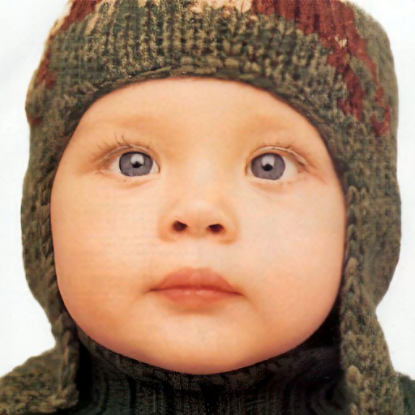
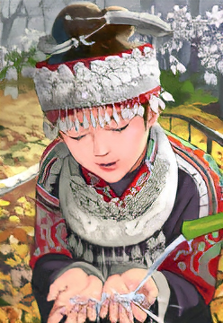
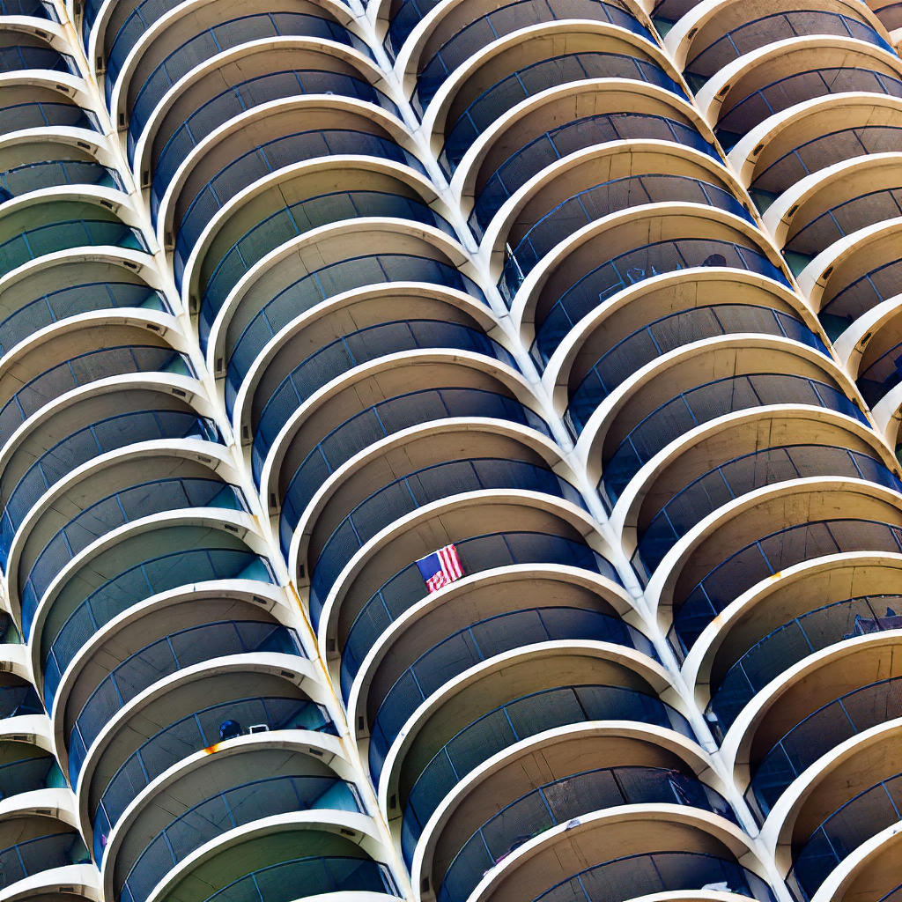

# ESRGAN  
A PyTorch implementation of ESRGAN. Additionally, a weight file trained for 200 epochs will be provided.
## Datasets  
### Train Dataset  
- DIV2K  
- Flickr2K  
- OutdoorSceneTraining (OST)  
I'll organize these three datasets, and after removing images with height or width less than 128, I'll compress them into a file called "train_HR.zip.", Download the dataset from [here]()(Baidu Link)(*TODO File uploading*).  
## Pytorch Weight file  
A weight file for a generator and discriminator model trained for 200 epochs can be download from [here](https://drive.google.com/file/d/1Jf_4rASdjtedA26Cs3-XJXzQ6T6drpJe/view?usp=sharing) and [here](https://drive.google.com/file/d/1voqyPbb-6yUCqZ2Vc3Z3SSlVrYDhPHSV/view?usp=sharing)(Google Drive Link).  
## Usage  
### Train  
```
python esrgan.py  

optional arguments:
  -h, --help            show this help message and exit
  --epoch EPOCH         epoch to start training from
  --n_epochs N_EPOCHS   number of epochs of training
  --lr LR               adma: learning rate
  --hr_height HR_HEIGHT
                        high res. image height
  --hr_width HR_WIDTH   high res. image width
  --sample_interval SAMPLE_INTERVAL
                        interval between saving image samples
  --residual_blocks RESIDUAL_BLOCKS
                        number of residual blocks in the generator
  --warmup_batches WARMUP_BATCHES
                        number of batches with pixel-wise loss only
  --lambda_adv LAMBDA_ADV
                        adversial loss weight
  --lambda_pixel LAMBDA_PIXEL
                        pixel-wise loss weight
  --lambda_content LAMBDA_CONTENT
                        content loss weight
```  
### Train details  
- First, you should train a PSNR-oriented model with the L1 loss. 
- Then employ the trained PSNR-oriented model as an initialization for the generator.  
In the first stage, if the number of backpropagation iterations is set to be small, the ratio between the pixel-wise loss and the perceptual loss in the second stage needs to be increased. If the ratio between them is too small, the phenomenon of the restored image being overly bright may occur.
According to the Real-ESRGAN paper, the weights of pixel-wise loss, perceptual loss, and GAN loss are set to 1, 1, and 0.1, respectively. The warm-up iterations can be set as needed, with a default of 500 iterations, batch_size=64.
### Test Single Image  
```
python test_image.py  

optional arguments:
  -h, --help            show this help message and exit
  --upscale_factor UPSCALE_FACTOR
                        super resolution upscale factor
  --test_mode {CPU,GPU}
                        using CPU or GPU
  --image_name IMAGE_NAME
                        test low resolution image name
  --model_name MODEL_NAME
                        generator model epoch name
```  
## test Single Image Results  
**Upscale factor = 4**  
low quality image:  
  
ESRGAN results:  
  
low quality image:  
  
ESRGAN results:  
  
low quality image:  
  
ESRGAN results:  
  
low quality image:  
  
ESRGAN results:  
  
low quality image:  
  
ESRGAN results:  
  
## training results  
**Upscale Factor = 4**  
This is a batch of images saved every 100 batches.The leftmost column is the low-resolution image obtained by interpolation using the BICUBIC method. The middle column is the original high-resolution image, and the rightmost column is the super-resolution image reconstructed using the model.  
  
